# PreFlight v2 — Diagram Reference

Companion to [`preflight-v2-spec.md`](./preflight-v2-spec.md) §6.

This file is the source-of-truth for every renderable diagram in the v2 spec. Each entry holds the Mermaid source (renders live on GitHub, VS Code Mermaid extension, mermaid-cli, mermaid.live, or any standard Mermaid renderer) plus a one-paragraph caption that describes what's in the rendered image so the diagrams are reasonable to discuss in text-only contexts.

Images John provided on 2026-05-20 confirm the rendered output for the A-series, B-series, and D.3/D.4 diagrams. The C-series are data-viz specs (stacked bars, pies, donut, scatter, heatmap) not yet rendered as images; the bullets under each describe what the chart should show.

---

## Section A — Taxonomy and infrastructure

### A.1 Probe taxonomy family tree

The 12 user-facing families fan out from a single "PreFlight: 156 probes" root node. F1 (React hygiene, 22) and F3 (Error handling, 22) are the largest families; F12 (Database, 10) and F11 (Backend/API, 11) are the smallest. F0 (host/framework detector, 6) is cross-cutting infrastructure and is shown separately in A.3.

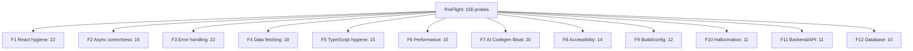

### A.2 Detection routing flowchart

The full edit-time pipeline. A keystroke fires a 300ms debounce; the debounced source flows into Lezer for incremental parse; then through three context detectors (host, framework, hook-context, async-context) that scope which probe families run; then through the Worker scan that produces findings; then to the UI render (findings panel + gutter markers). The host/framework detection happens once and cascades; the hook-context and async-context detection are scope-aware and run continuously as the user types.

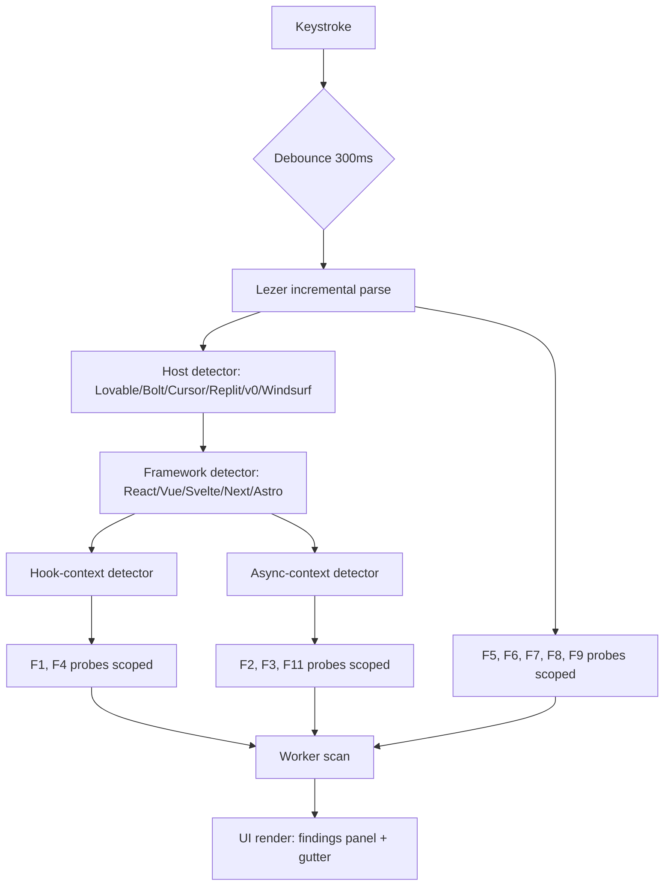

### A.3 Cross-family infrastructure dependency graph

What infrastructure each family depends on. Host detector touches every family (routes UX/copy by tool). Framework detector gates F1/F4/F6/F8. Hook-context gates F1/F4. Async-context gates F2/F3/F11. TS type info (TypeScript compiler in Worker, on-save only) gates the entire F5 family and the high-confidence floating-promise subset of F2. Control-flow graph required for F1 race conditions, F3 reachability checks, and F11 response-after-response detection. AST hash equivalence used by F7 (duplicate block detection) and F12 (duplicate query detection).

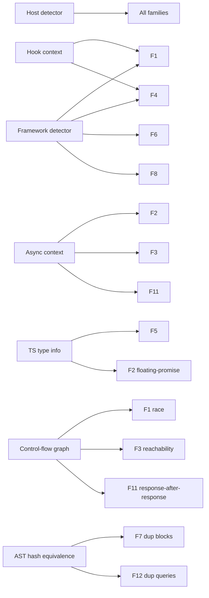

---

## Section B — User journey, scan pipeline, persona handoff, telemetry, onboarding, finding state

### B.1 User journey landing to retention

A linear flow from first paste to spaced-recall surfacing. Landing → first scan in 250ms → findings panel reveals breadth → inline gutter + hover summary → open one finding → branches into Sam fix card and Demi essay card → user types fix in sandbox → victory state → branches to "next finding" and "3-day spaced recall surface". The branching at the end is the retention hook: the spaced-recall path runs even if the user closes the tab, and re-engages them with the same concept on day 3.

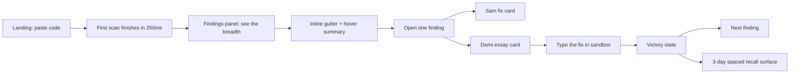

### B.2 Scan pipeline (sequence diagram)

Five participants: User, Editor (CodeMirror 6), Lezer, Worker (SWC + probes), Findings UI. User keystroke triggers incremental Lezer parse → highlight update back to the editor. After a 300ms debounce, the editor posts source plus the Lezer tree hint to the Worker. Worker runs SWC AST construction, then framework/host/hook/async detectors, then the scoped probes, all inside the Worker (off main thread). Finding deltas (new and resolved) flow back to the Findings UI which updates both the gutter and the right-side panel.

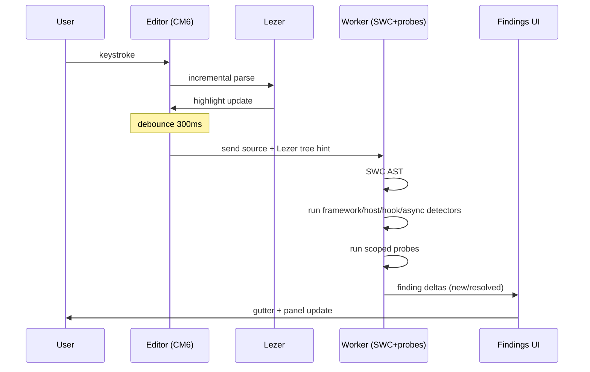

### B.3 Persona handoff

How a finding routes through Sam, Demi, Drew, Vera. A finding arrives at a confidence branch. High and medium confidence flow straight to "Sam fix + Demi context" (the default presentation). Low confidence routes through a Vera gate first: the finding is wrapped in "PreFlight thinks this might be…" copy that explicitly tells the user the probe is heuristic. From the Sam+Demi presentation, an architectural branch decides whether Drew (the refactor persona) also surfaces: yes for architectural fixes that need a multi-file change, no for fixes that fit inside the current file. Both paths converge on "Apply fix".

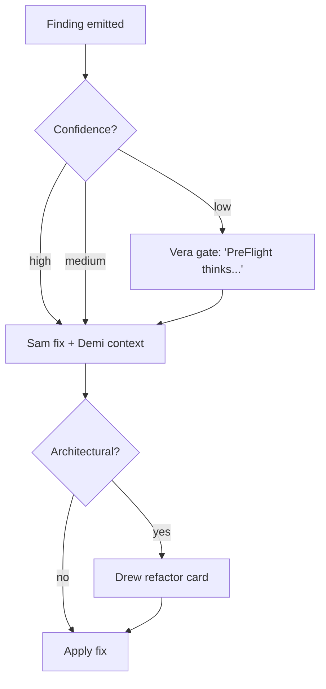

### B.4 Telemetry flow with privacy gates

What happens when a user clicks the "Make PreFlight Better" button. The button expands a panel that shows the exact JSON payload (per §1.14 of the spec) plus three consent checkboxes for snippet sharing, free-text message, and follow-up email. Nothing leaves the tab unless the user clicks send. Three branches based on consent flags: snippet OFF + message OFF sends only probe_id + user_action (smallest possible); snippet ON adds the redacted snippet; message ON adds the free-text message. All three converge on a single POST to the telemetry endpoint. The branching makes the privacy contract visible at the point of interaction.

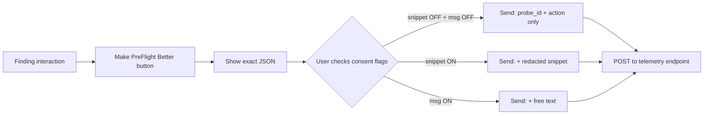

### B.5 Web Worker offloading

The clean separation between main thread (editor + UI) and the dedicated Worker. Main thread posts source via postMessage to Worker. Worker holds three components: SWC-WASM (always-on for AST), TS compiler with virtual filesystem (optional; only loaded for on-save TypeScript-typed probes), and the Probe runner. Findings flow back to main thread. The dashed line from TS compiler to Probe runner conveys that the TS dependency is on-save only — it doesn't fire on every keystroke.

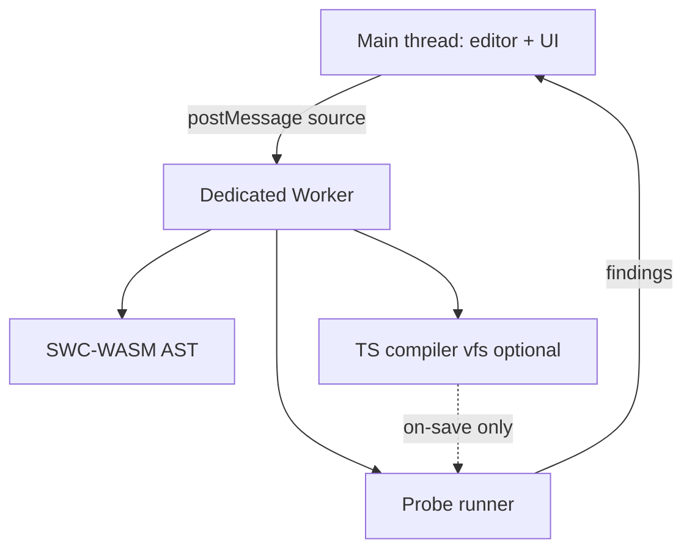

### B.6 First-time onboarding

The host-aware onboarding path. Visit branches on "Host known?" — yes routes to a welcome with host-specific copy and a pre-loaded broken example targeting that host's typical output (Lovable example for Lovable users, Bolt example for Bolt, etc.). No routes to a generic welcome and a generic broken example. Both converge at "Scan fires, breadth revealed" — the moment the user sees the volume of findings the tool surfaces — and then "Open one finding → Demi master essay" delivers the first teaching moment.

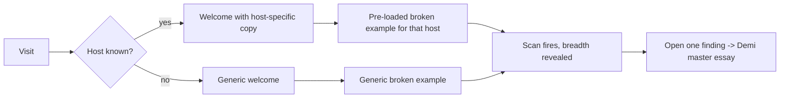

### B.7 Finding state machine

The finding lifecycle. Initial state New on emission. User hovers → Acknowledged. From Acknowledged, three transitions: typed-fix-passes-probe → Fixed (terminal); user-clicked-dismiss → Dismissed; user-clicked-Make-PreFlight-Better-as-FP → FPReported (terminal). The Dismissed state is not terminal — a subsequent code edit re-triggers the probe and returns the finding to New, so a dismiss is per-encounter, not permanent. Fixed and FPReported both flow to the end-state circle.

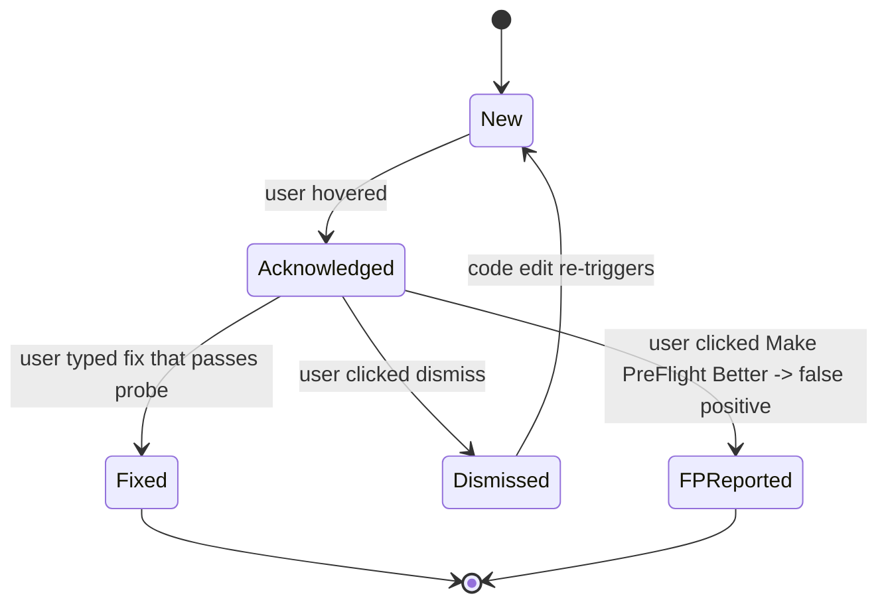

---

## Section C — Distribution charts (data specs; no Mermaid)

These are data-viz charts, not Mermaid graphs. Specs from §6 of the spec; renderable in any charting library.

- **C.1 Severity stacked bar.** Per-family breakdown of critical/high/medium/low/info counts. Sampled families: F1 (0/8/10/3/1=22), F3 (0/7/11/3/1=22), F4 (2/5/8/2/1=18), F10 (4/4/2/1/0=11), F12 (3/4/2/1/0=10). Render as stacked horizontal bars per family.
- **C.2 Confidence stacked bar.** Totals: 78 high, 58 medium, 20 low. Family breakdowns derivable from per-probe routing tables.
- **C.3 Detection complexity pie.** 70 simple, 58 medium, 28 complex.
- **C.4 Sandbox suitability donut.** 82 live, 46 debounced, 22 on-save, 6 full-scan.
- **C.5 FP-risk vs value scatter.** X axis FP risk (0 to 1), Y axis value (severity × prevalence). Top-right empty (no high-FP-high-value without Vera gating). Bottom-right populated with the Top 10 from §1.6.
- **C.6 Prevalence bars per family.** F1 86% of repos (StackInsight). F3 89.1% of all AI-introduced issues are code smells (Li et al. 2026). F10 19.7% of LLM-suggested packages are hallucinations (Spracklen et al. USENIX 2025). F8 16.2% of homepage images missing alt; 33.1% of form inputs unlabeled (WebAIM Million 2026). F12 10.3% of Lovable showcase apps had inadequate RLS (CVE-2025-48757). F11 100% of Tenzai's 15 apps had SSRF; 0% had CSRF or security headers.
- **C.7 Performance budget allocation.** F1 4ms, F2 5ms, F3 3ms, F4 5ms, F5 8ms on-save, F6 3ms, F7 6ms on-save, F8 2ms, F9 1ms on-save, F10 10ms on-save, F11 4ms, F12 4ms. Sum of "live" budgets well inside the 16ms frame.
- **C.8 Existing-tool coverage heatmap.** Per the matrix in §5 of the spec. Hottest gaps: F7 (no tool covers AI codegen bloat), F10 (no tool covers hallucination), F12 (no in-browser RLS-aware tooling).

---

## Section D — Learning arcs and retention

### D.1 Learning arc per family (text spec)

Each family is a 5 to 10 probe path. F1 example: missing-cleanup → missing-deps → state-in-render → effect-as-event-handler → object-literal-in-deps → conditional-hook → race-in-effect.

### D.2 Core-five inoculation map (text spec)

Day 1 surface: `probe_error_broad_catch_swallow`, `probe_react_useeffect_listener_no_cleanup`, `probe_async_n_plus_1_await_in_loop`, `probe_a11y_img_no_alt`, `probe_data_supabase_rls_missing_select_all`.

### D.3 Retention loop

The full spaced-recall journey. Linear chain: Paste code → Scan → Demi essay → Sam fix → Typed sandbox fix → Day 1 spaced recall → Day 3 → Day 7 → Day 21 → Transfer (probe fires on user's own project). The Transfer node is the success state: the concept generalized from the tutorial sandbox to the user's real work.

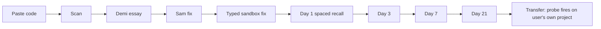

### D.4 Cross-family prerequisite graph

Concept dependencies between families. Closures basics → F1. Event loop basics → F2 → F3. HTTP semantics → F2 and F11. Type narrowing → F5. F1 → F4. F11 → F12. F6 has a soft (dashed) dependency on F1 because performance regressions in React often follow from lifecycle bugs.

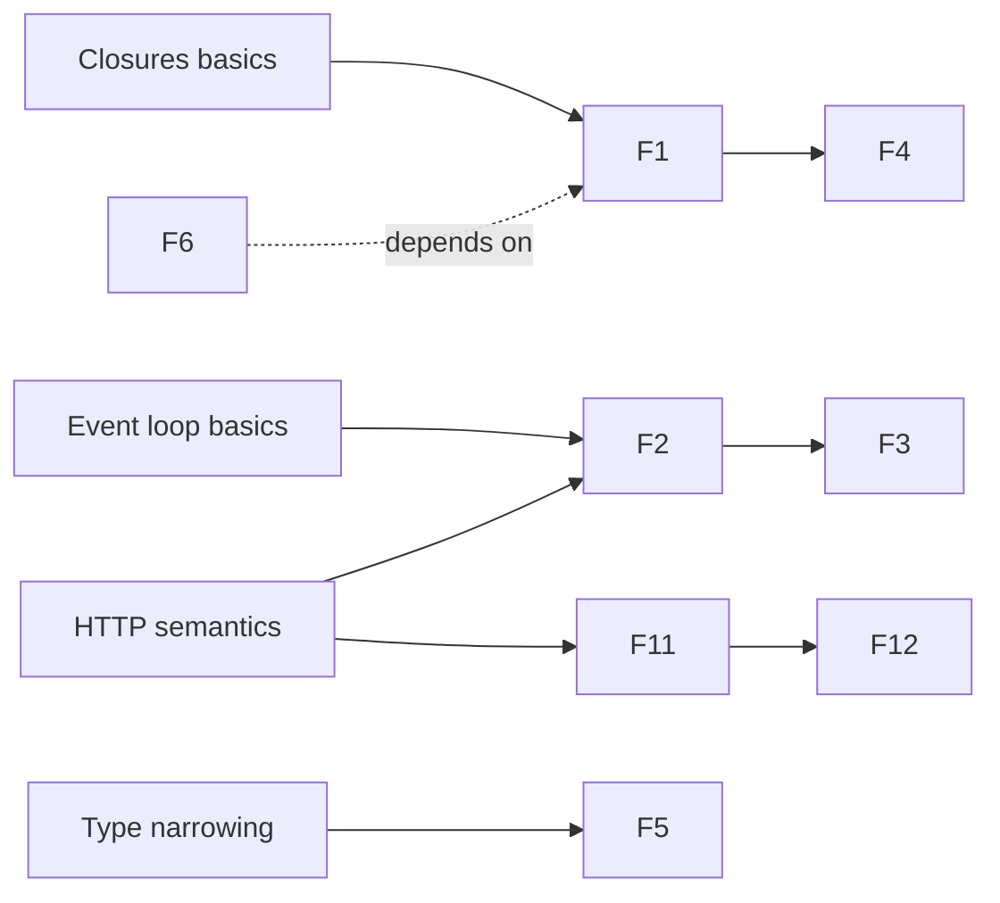

### D.5 Spaced repetition schedule (text spec)

Expanding ISI per Cepeda, Pashler, Vul, Wixted, Rohrer (Psychological Bulletin 132(3), May 2006): 1 day, 3 days, 7 days, 21 days, 60 days.

### D.6 Persona learning ownership (text spec)

Sam owns field 16 (fix pattern). Demi owns fields 4, 17, 26 (description, essay, retention hook). Drew owns refactor-class probes (mostly in F7). Vera owns confidence gating (field 10 plus the UI surface that gates low-confidence findings).
